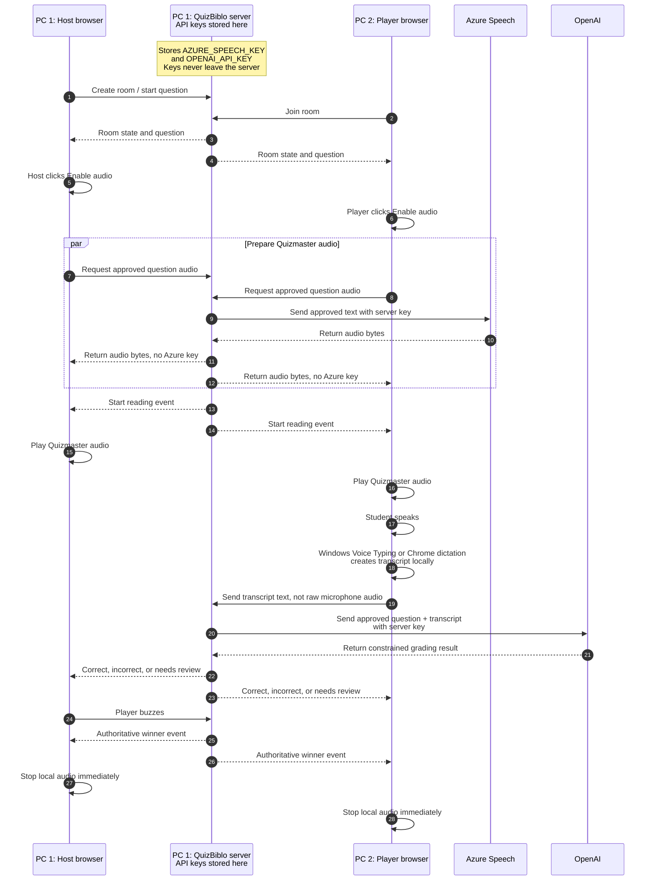
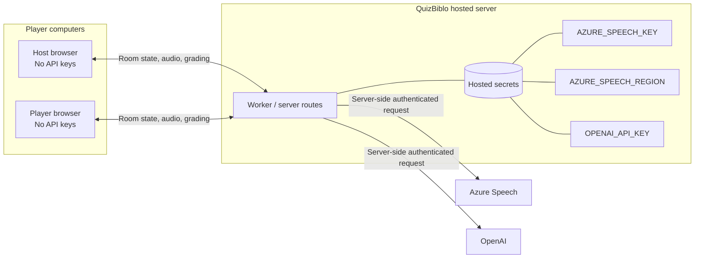

# QuizBiblo API Key and Voice Flow

This diagram shows how two computers use one server-side set of API keys. The
player computers do not need Azure Speech or OpenAI keys.

## Two-Computer Local Hosting

## Public Hosted Mode

The public URL works the same way, except the server is the hosted Sites/Worker
environment rather than the host's Windows PC.

## Key Rules

- The host player is not automatically the API-key owner. The server is the key owner.
- If one PC runs the local server, only that PC needs the keys.
- Every browser can join without an Azure or OpenAI key.
- Windows Voice Typing and Chrome dictation convert speech to text on the player's computer.
- QuizBiblo receives transcript text for grading; it does not need to receive raw microphone audio in the baseline design.
- Azure Speech and OpenAI keys must never be placed in browser JavaScript, local storage, GitHub, issue comments, or visible network payloads.
- If the server stops, local in-memory developer keys are lost and must be entered again.
- In production, hosted secrets remain with the hosting environment and are not entered into the player UI.
